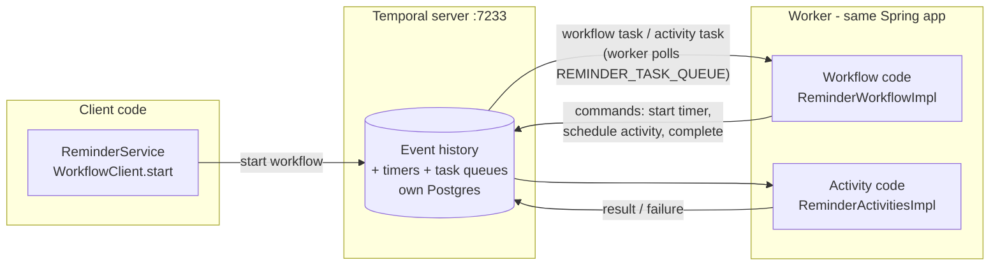
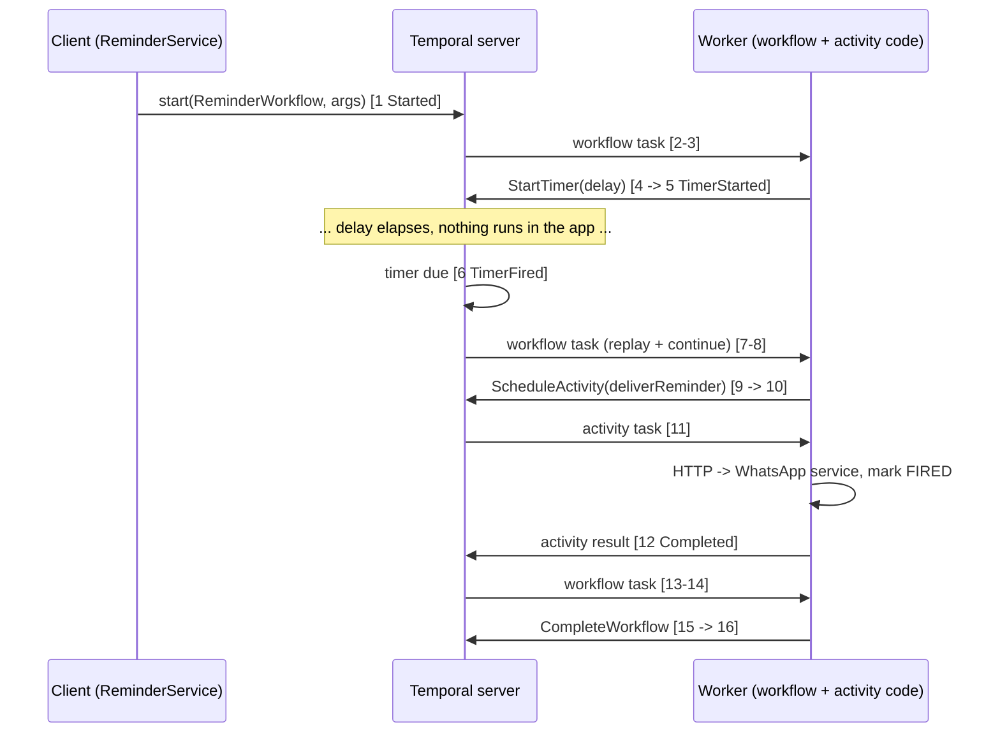

# Temporal Guide - how `temporal-workflow-service` uses Temporal

A focused guide to **Temporal** as it is used in this project: the mental model, how the service is
wired to it, exactly what Temporal records for one reminder, how to inspect and operate it, how to
change the code safely, and how to test it.

> **Related documents**
>
> * [`REMINDER_SERVICES_GUIDE.md`](REMINDER_SERVICES_GUIDE.md) - the whole platform. Start there for the
>   big picture, the WhatsApp side and the business flow.
>   * End-to-end sequence: [Section 3](REMINDER_SERVICES_GUIDE.md#3-end-to-end-walkthrough-of-one-reminder)
>   * The WhatsApp service in full: [Section 4](REMINDER_SERVICES_GUIDE.md#4-service-1---whatsapp-flow-engine-service-v3)
>   * The reminder service (business view): [Section 5](REMINDER_SERVICES_GUIDE.md#5-service-2---temporal-workflow-service)
>   * Log-by-log tracing: [Section 8](REMINDER_SERVICES_GUIDE.md#8-logging-guide)
>   * "No reminder arrived" checklist: [Section 10](REMINDER_SERVICES_GUIDE.md#10-troubleshooting-i-did-not-get-the-reminder)
>   * Known limitations: [Section 11](REMINDER_SERVICES_GUIDE.md#11-known-limitations-and-suggested-next-steps)
> * [`README.md`](README.md) - flow-engine quick reference.

This guide does **not** repeat the WhatsApp/Flow material. Wherever the two meet, it links to the
matching section of `REMINDER_SERVICES_GUIDE.md` instead.

Everything stated as fact here was either read from the source or verified against the running
system: the event history below was generated by running the real `ReminderWorkflowImpl` in
Temporal's test server, its length (16 events) matches a completed reminder workflow observed on the
local Temporal server, and the test examples in [Section 12](#12-testing-workflows) were compiled and
run (5/5 passing on SDK 1.39.0). Design sketches that are *not* in the codebase are labelled as such.

---

## Table of contents

1. [Why Temporal is here](#1-why-temporal-is-here)
2. [The mental model](#2-the-mental-model)
3. [Temporal in this project - components](#3-temporal-in-this-project---components)
4. [Spring Boot wiring](#4-spring-boot-wiring)
5. [What Temporal records for one reminder](#5-what-temporal-records-for-one-reminder)
6. [Determinism and replay](#6-determinism-and-replay)
7. [Activities, retries and timeouts](#7-activities-retries-and-timeouts)
8. [Workflow ids and idempotency](#8-workflow-ids-and-idempotency)
9. [Using the Temporal UI and API](#9-using-the-temporal-ui-and-api)
10. [Operating reminders: cancel, terminate, reschedule](#10-operating-reminders-cancel-terminate-reschedule)
11. [Changing workflow code safely (versioning)](#11-changing-workflow-code-safely-versioning)
12. [Testing workflows](#12-testing-workflows)
13. [Failure modes seen from Temporal's side](#13-failure-modes-seen-from-temporals-side)
14. [Production considerations](#14-production-considerations)
15. [FAQ](#15-faq)
16. [Cheat sheet](#16-cheat-sheet)

---

## 1. Why Temporal is here

The product requirement is simple: *"send this customer a WhatsApp message at time T"*, where T can be
days away. Doing that with an in-process scheduler (`@Scheduled`, `Timer`, a cron table) means writing
and maintaining your own answers to:

* What if the app restarts while 12 reminders are pending?
* What if two instances run - does the reminder fire twice or never?
* What if delivery fails - who retries, how many times, with what backoff?
* How do I see what is pending, and why something did not fire?

Temporal is a *durable execution* engine that answers all of those. You write the reminder as
ordinary code ("sleep until T, then deliver") and Temporal guarantees it survives restarts, retries the
delivery, and lets you inspect every step. The price is a Temporal server to run and a set of rules for
the workflow code ([Section 6](#6-determinism-and-replay)).

---

## 2. The mental model

### 2.1 Three roles



| Role | In this project | Responsibility |
|---|---|---|
| **Temporal server** | Docker container `temporal` (`temporalio/auto-setup:1.24.2`) | Persists every workflow's **event history** and timers in *its own* Postgres. Decides what work is due and puts tasks on task queues. Runs no application code. |
| **Client** | `ReminderService` (uses the auto-configured `WorkflowClient`) | Starts workflows, queries/cancels them. Fire-and-forget: `WorkflowClient.start` returns once the server has accepted the workflow. |
| **Worker** | Inside `temporal-workflow-service` (same JVM as the REST API) | *Polls* the server over gRPC for tasks and runs your workflow and activity code. |

Key consequence: **the server never calls your app**; the worker pulls tasks. That is why a restarted
worker simply resumes: it reconnects and polls again.

### 2.2 Workflow vs activity

| | Workflow | Activity |
|---|---|---|
| Purpose | Orchestration: order, waiting, decisions | One side-effecting step (HTTP call, DB write) |
| Here | `ReminderWorkflowImpl.remind` (sleep, then call the activity) | `ReminderActivitiesImpl.deliverReminder` (HTTP to WhatsApp service + mark `FIRED`) |
| May do I/O? | **No** - must be deterministic | Yes |
| Retried by Temporal? | Not "retried" - **replayed** from history | Yes, per its retry policy |
| Duration | Can be days/years (mostly asleep) | Should be short (here: 30 s limit) |

### 2.3 Durable execution in one paragraph

Whenever the workflow does something that matters (starts a timer, schedules an activity, finishes),
Temporal appends an **event** to that workflow's history in the server's database. If the worker dies,
another (or the restarted) worker re-runs the workflow code from the top - **replaying** it against the
recorded history. Already-recorded steps are *not* executed again; the code is just fed the recorded
results until it catches up to where it stopped, and then continues with new work. So a reminder that
slept for two of its three days simply resumes with one day left.

### 2.4 Vocabulary

| Term | Meaning |
|---|---|
| **Namespace** | Isolation unit on the server. This project uses `default`. |
| **Task queue** | Named queue a worker polls. Here `REMINDER_TASK_QUEUE` (constant `ReminderTaskQueue.NAME`). |
| **Workflow id** | Your business-unique id: `reminder-REM-XXXXXXXX`. |
| **Run id** | Id of one execution of a workflow id (UUID). |
| **Workflow task** | A unit of work for the worker to advance workflow code until it blocks (on a timer/activity) or finishes. |
| **Activity task** | A unit of work: run one activity attempt. |
| **Command** | What workflow code emits to the server: `StartTimer`, `ScheduleActivityTask`, `CompleteWorkflowExecution`... |
| **Event** | What the server records: `TimerStarted`, `ActivityTaskCompleted`... |
| **Timer** | Server-side wake-up. While it runs, **no thread and no memory** are held in your app. |

---

## 3. Temporal in this project - components

| Component | Where | Notes |
|---|---|---|
| Temporal server | `docker-compose.yml` (in this repo; the author's original copy is in the parent dir) service `temporal`, port **7233** (gRPC) | `temporalio/auto-setup:1.24.2`; auto-setup creates the schema and the `default` namespace on first start. |
| Temporal's database | service `temporal-postgres` (Postgres 16, user/password `temporal`) | **Separate** from the application Postgres on 5434 - never shared. |
| Temporal Web UI | service `temporal-ui` (`temporalio/ui:2.31.2`), **http://localhost:8088** | Inspect workflows and histories. No authentication enabled. |
| Temporal Java SDK | `io.temporal:temporal-spring-boot-starter:1.39.0` (in `temporal-workflow-service/pom.xml`) | Plus `temporal-testing:1.39.0` in test scope. |
| Worker + client | `temporal-workflow-service` (port 8083) | Both in one Spring Boot app. |
| Business record | Postgres `chatbot_reminder`, table `reminder` | The app's own view; see [REMINDER_SERVICES_GUIDE §5.4](REMINDER_SERVICES_GUIDE.md#5-service-2---temporal-workflow-service). |

Facts read from the live local server:

* Namespace `default` has **execution retention of 86,400 s (24 h)**, history and visibility archival
  **disabled**. *Closed* workflows are deleted from Temporal 24 h after they finish; *running*
  workflows are never expired. Practical effect: after a day the `reminder` table is the only record
  that a reminder ever existed ([Section 14](#14-production-considerations)).
* The same Temporal server is shared with the sibling `yaml-workflow-service` (its `YamlWorkflow`
  executions appear on the queue `YAML_WORKFLOW_TASK_QUEUE`). Reminders are identifiable by workflow
  type `ReminderWorkflow` and queue `REMINDER_TASK_QUEUE`.

Start-up order and the docker command are in
[REMINDER_SERVICES_GUIDE §7](REMINDER_SERVICES_GUIDE.md#7-running-everything-locally); ports are in
[§6](REMINDER_SERVICES_GUIDE.md#6-infrastructure-and-ports).

---

## 4. Spring Boot wiring

The `temporal-spring-boot-starter` does the plumbing so the app contains **no worker/client
bootstrap code**.

### 4.1 Configuration (`application.yaml`)

```yaml
spring:
  temporal:
    connection:
      target: 127.0.0.1:7233          # Temporal frontend (gRPC)
    namespace: default
    workers-auto-discovery:
      packages:
        - com.hdfc.temporal_workflow_service
```

### 4.2 What the starter creates

* A `WorkflowServiceStubs` connection to `127.0.0.1:7233`.
* A `WorkflowClient` bean (injected into `ReminderService`).
* A `WorkerFactory` and, via **auto-discovery**, one worker per task queue found by scanning the listed
  packages.

### 4.3 The annotations that make discovery work

| Class | Annotation | Effect |
|---|---|---|
| `ReminderWorkflow` (interface) | `@WorkflowInterface`, method `@WorkflowMethod remind(...)` | Declares the workflow type `ReminderWorkflow` and its single entry point. |
| `ReminderWorkflowImpl` | `@WorkflowImpl(taskQueues = ReminderTaskQueue.NAME)` | Registers the implementation on `REMINDER_TASK_QUEUE`. |
| `ReminderActivities` (interface) | `@ActivityInterface`, `@ActivityMethod deliverReminder(...)` | Declares the activity. |
| `ReminderActivitiesImpl` | `@Component` + `@ActivityImpl(taskQueues = ReminderTaskQueue.NAME)` | A **Spring bean** registered as the activity implementation on the same queue - so it can inject `ReminderDeliveryClient` and `ReminderRepository`. |

`WorkflowImpl` classes are *not* Spring beans (Temporal instantiates a fresh object per workflow
execution); `ActivityImpl` classes *are* (shared, thread-safe singletons). That is why the workflow
uses `Workflow.newActivityStub(...)` while the activity has constructor-injected dependencies.

### 4.4 The client side

`ReminderService.createReminder` builds a typed stub and starts it asynchronously:

```java
ReminderWorkflow workflow = workflowClient.newWorkflowStub(
        ReminderWorkflow.class,
        WorkflowOptions.newBuilder()
                .setWorkflowId(workflowId)              // "reminder-" + reminderId
                .setTaskQueue(ReminderTaskQueue.NAME)   // must match the worker's queue
                .build());
WorkflowExecution execution =
        WorkflowClient.start(workflow::remind, reminderId, waId, message, remindAt);
```

`WorkflowClient.start` returns the moment the server accepts the request; the call does **not** wait for
the reminder to fire. (`workflow.remind(...)` called directly would block until completion - days.)
The task queue name is the contract tying client, workflow registration and worker together: a typo in
any one of them leaves workflows accepted but never executed (they sit "Running" with no progress).

The `remindAt` argument (an `Instant`) and the other arguments are serialised as JSON into the first
history event, so they are visible in the UI ([Section 9](#9-using-the-temporal-ui-and-api)).

---

## 5. What Temporal records for one reminder

Here is the actual event history for one `ReminderWorkflow` run (generated by running this project's
`ReminderWorkflowImpl` against Temporal's test server; a real completed reminder on the local server
reported `historyLength: 16`, identical).

| Event id | Event type | Meaning here |
|---|---|---|
| 1 | `WorkflowExecutionStarted` | `WorkflowClient.start` accepted. Input = `reminderId, waId, message, remindAt`. |
| 2 | `WorkflowTaskScheduled` | Server queued the first workflow task on `REMINDER_TASK_QUEUE`. |
| 3 | `WorkflowTaskStarted` | A worker picked it up. |
| 4 | `WorkflowTaskCompleted` | Worker ran `remind()` up to `Workflow.sleep(...)` and reported the command **StartTimer**. Log: `Reminder timer started ... sleeping=...`. |
| 5 | `TimerStarted` | Server created the durable timer for the delay. *The workflow now costs nothing until it fires.* |
| 6 | `TimerFired` | Delay elapsed (about 3 minutes later in DEMO mode). |
| 7 | `WorkflowTaskScheduled` | Server queued a workflow task to wake the workflow. |
| 8 | `WorkflowTaskStarted` | Worker picked it up; it **replays** history 1-6 (no duplicate logs - replay-aware logger). |
| 9 | `WorkflowTaskCompleted` | Worker continued: logged `timer fired`, emitted **ScheduleActivityTask** for `deliverReminder`. |
| 10 | `ActivityTaskScheduled` | Server queued the activity task. |
| 11 | `ActivityTaskStarted` | Worker started attempt 1 (retries do not add events until the final outcome - see 7.2). |
| 12 | `ActivityTaskCompleted` | HTTP call to the WhatsApp service succeeded; row marked `FIRED`. |
| 13 | `WorkflowTaskScheduled` | Server queued a task so the workflow can react to the activity result. |
| 14 | `WorkflowTaskStarted` | Worker picked it up (replays 1-12). |
| 15 | `WorkflowTaskCompleted` | Worker logged `workflow completed`, emitted **CompleteWorkflowExecution**. |
| 16 | `WorkflowExecutionCompleted` | Workflow closed successfully. |



Read the "Workflow tasks" (events 2-4, 7-9, 13-15) as *the worker briefly waking the workflow code*.
Total worker time across the whole reminder is milliseconds; the rest is a timer inside the server.

Mapping to the application log lines is in
[REMINDER_SERVICES_GUIDE §8](REMINDER_SERVICES_GUIDE.md#8-logging-guide) (rows 5-11 are these events).
What the WhatsApp service does during event 11-12 is
[§4.10](REMINDER_SERVICES_GUIDE.md#410-reminder-delivery---post-messagesreminder).

> **Where does the wait time come from?** From the `remindAt` computed by the WhatsApp service
> ([§4.9 DEMO vs PRODUCTION](REMINDER_SERVICES_GUIDE.md#49-the-funds-reminder-in-detail-demo-vs-production)).
> Temporal itself has no notion of "3 minutes vs 3 days"; it just sleeps for whatever
> `remindAt - now` is.

---

## 6. Determinism and replay

### 6.1 The rule

Workflow code is re-executed (replayed) whenever a worker needs to rebuild its state: after a restart,
when it was evicted from the worker's cache, or on every workflow task after a wait. For replay to
reproduce the same commands, **workflow code must be deterministic**: the same history must always
produce the same sequence of commands.

### 6.2 What that means for `ReminderWorkflowImpl`

```java
Instant now = Instant.ofEpochMilli(Workflow.currentTimeMillis());   // OK: deterministic clock
Duration delay = Duration.between(now, remindAt);
if (delay.isPositive()) {
    Workflow.sleep(delay);                                          // OK: durable timer
}
activities.deliverReminder(...);                                    // OK: side effects via an activity
```

| Do | Don't (inside workflow code) |
|---|---|
| `Workflow.currentTimeMillis()` | `Instant.now()`, `System.currentTimeMillis()` |
| `Workflow.sleep(...)` | `Thread.sleep(...)` |
| `Workflow.newRandom()`, `Workflow.randomUUID()` | `Math.random()`, `UUID.randomUUID()` |
| Activities for HTTP/DB/files | `RestClient`, JPA, file I/O directly |
| `Workflow.getLogger(...)` | a plain static SLF4J logger (works, but duplicates lines on every replay) |
| Deterministic loops over inputs | Iterating a `HashMap` where order matters, threads, `synchronized` blocking |

The workflow's **inputs** (`reminderId, waId, message, remindAt`) are frozen in event 1, so
`remindAt` is stable across replays even though wall-clock time keeps moving.

### 6.3 Replay-aware logging

`ReminderWorkflowImpl` uses `Workflow.getLogger(ReminderWorkflowImpl.class)`. During replay it
suppresses output, so after a worker restart you do not see `Reminder timer started ...` printed again
for reminders that were already sleeping. The workflow logs each line exactly once, when the step really
happens. (Activity code, in contrast, is normal application code and logs normally.)

### 6.4 What replay looks like operationally

* Restart the reminder service with N reminders sleeping: nothing is lost. On startup the worker polls;
  a workflow is only loaded (and replayed) when it has a task - i.e. when its timer fires. Sleeping
  workflows are not eagerly re-executed.
* If replay ever produces a *different* command than history recorded, the worker raises a
  non-determinism error and that workflow is stuck until code is fixed - this is what
  [Section 11](#11-changing-workflow-code-safely-versioning) exists to prevent.

---

## 7. Activities, retries and timeouts

### 7.1 Configuration in this project

From `ReminderWorkflowImpl`:

```java
ActivityOptions.newBuilder()
        .setStartToCloseTimeout(Duration.ofSeconds(30))
        .setRetryOptions(RetryOptions.newBuilder().setMaximumAttempts(5).build())
        .build();
```

| Setting | Value | Meaning |
|---|---|---|
| `startToCloseTimeout` | 30 s | One *attempt* may run at most 30 s. A hung HTTP call is abandoned and retried. |
| `maximumAttempts` | 5 | Total attempts (first + 4 retries). |
| Other retry fields | Temporal defaults | Initial interval 1 s, backoff x2 up to a cap of 100 s, no non-retryable error types configured. |
| `scheduleToCloseTimeout` / heartbeats | not set | No overall deadline across attempts; no heartbeating (unneeded for a short call). |

### 7.2 Behaviour, verified by test

The following was run against Temporal's test server (see [Section 12](#12-testing-workflows)):

* An activity that fails on attempts 1 and 2 and succeeds on attempt 3 -> the workflow **completes**;
  exactly 3 attempts were made.
* An activity that always fails -> exactly **5 attempts**, then the workflow fails with
  `WorkflowFailedException` whose cause is an `ActivityFailure`.
* Retries of one activity are **not** separate history events; the history shows a single
  `ActivityTaskScheduled/Started` and the eventual `Completed` or `Failed`. Attempts are visible in the
  UI under "Pending Activities" while retrying, and in our own log line
  `Delivering reminder ... attempt=N` (from `Activity.getExecutionContext().getInfo().getAttempt()`,
  which is 1-based).

What "failure" means for our activity: any exception. The delivery HTTP call throws when the WhatsApp
service is unreachable or answers non-2xx; that happens when Meta rejects the text (expired token, 24 h
window, bad number - see [REMINDER_SERVICES_GUIDE §10](REMINDER_SERVICES_GUIDE.md#10-troubleshooting-i-did-not-get-the-reminder)).
Backoff between attempts is on the order of 1 s, 2 s, 4 s, 8 s - so all five attempts are over in
roughly 15 seconds. That is short if the WhatsApp service is down for a few minutes; see the
suggestions in [Section 14](#14-production-considerations).

### 7.3 At-least-once, not exactly-once

Temporal guarantees an activity's *completion* is recorded once, but it can **execute** more than once
(a retry after a timeout or a lost response). Two concrete consequences in this code:

1. `deliverReminder` calls the WhatsApp service **first**, then updates the `reminder` row inside a
   `@Transactional` method. If the HTTP call succeeded but the DB update fails, the whole activity is
   retried and the customer gets the text **twice**.
2. `/messages/reminder` does not receive the `reminderId`, so it cannot de-duplicate.

Both are listed in [REMINDER_SERVICES_GUIDE §11](REMINDER_SERVICES_GUIDE.md#11-known-limitations-and-suggested-next-steps).
The usual fix is to pass an idempotency key (the `reminderId`) to the delivery endpoint and have it
ignore a repeat.

### 7.4 Making an error non-retryable

Some failures will never succeed on retry (e.g. Meta says the number is invalid). Throwing
`ApplicationFailure.newNonRetryableFailure(message, type)` from an activity makes Temporal stop retrying
immediately. Today every failure is retried the full 5 times.

---

## 8. Workflow ids and idempotency

* The id is `reminder-` + `REM-` + 8 random hex characters, generated per call to `createReminder`.
* Because it is random, **every call creates a new workflow** - there is no built-in "one reminder per
  customer/session" rule. This is why a customer who goes BACK in the Flow and picks a timing again ends
  up with two reminders ([REMINDER_SERVICES_GUIDE §11 item 3](REMINDER_SERVICES_GUIDE.md#11-known-limitations-and-suggested-next-steps)).
* Temporal *does* enforce uniqueness of a workflow id among **running** workflows: starting a second
  workflow with the same id while the first runs is rejected (`WorkflowExecutionAlreadyStarted`). So a
  deterministic id makes scheduling idempotent for free.

> **Design suggestion (not implemented):** derive the id from something stable, e.g.
> `reminder-<flow_token>`. A retried Meta request for the same screen would then fail to start a second
> workflow instead of scheduling a duplicate. Handle the "already started" exception as success and
> return the existing reminder. Note the current `Reminder` row id and workflow id are the same
> random value, so this would also change how the `reminder` table is keyed.

Default id-reuse behaviour also matters after completion: with Temporal's defaults a *closed*
workflow's id may be reused, until the closed workflow's 24 h retention deletes it anyway.

---

## 9. Using the Temporal UI and API

### 9.1 Web UI - http://localhost:8088

(`temporalio/ui:2.31.2`; authentication is disabled in this setup - do not expose it beyond your
machine.)

| Goal | How |
|---|---|
| Find one reminder | Workflows page -> filter/search for the workflow id `reminder-REM-XXXXXXXX` (id printed in the log line `Reminder scheduled reminderId=...`). |
| List all pending reminders | Query: `WorkflowType="ReminderWorkflow" AND ExecutionStatus="Running"` |
| List everything on the reminder queue | `TaskQueue="REMINDER_TASK_QUEUE"` |
| Did it fire? | Open the workflow: status **Completed** and a `TimerFired` event. |
| What arguments did it get? | Open the workflow -> **Input** (from event 1): reminder id, wa_id, message, `remindAt`. |
| Why is it stuck "Running" after the due time? | Check **Workers** on the workflow page: no worker polling `REMINDER_TASK_QUEUE` means the reminder service is down or on the wrong queue/namespace. |
| Retrying delivery right now | **Pending Activities** section shows attempt count, last failure message and next retry time. |
| Failed workflow | Status **Failed**; the failure shows `ActivityFailure` with the underlying HTTP error from the WhatsApp service. |

The tabs to know: **Summary** (status, timing), **History** (the 16 events from
[Section 5](#5-what-temporal-records-for-one-reminder), with a timeline view), **Pending Activities**,
**Workers**, and **Stack Trace** (where a *running* workflow is currently blocked - for a sleeping
reminder it points at `Workflow.sleep`).

### 9.2 The UI's HTTP API (handy for scripts)

The UI server proxies a JSON API. Verified against the local instance:

```bash
# namespace config (retention etc.)
curl -s http://localhost:8088/api/v1/namespaces/default

# list workflows (running and closed, newest first)
curl -s "http://localhost:8088/api/v1/namespaces/default/workflows"
```

The list response includes, per execution: `workflowId`, `runId`, `type.name`, `status`
(`WORKFLOW_EXECUTION_STATUS_RUNNING` / `_COMPLETED` / `_FAILED` ...), `startTime`, `closeTime`,
`taskQueue` and (for closed ones) `historyLength`. Use the UI for per-event history; it is the reliable
way to see it in this setup.

### 9.3 Reading a workflow's timing from the UI

`closeTime - startTime` on a completed reminder is roughly the wait to `remindAt` plus the time the
delivery activity took (including any retries and their backoff). For example, one completed reminder on
the local server started 06:43:15 and closed 06:46:23 UTC (about 3 min 8 s, history length 16). If that
gap is much larger than the delay you expected, look at the History tab for when `TimerFired` happened
versus when `ActivityTaskCompleted` did, and at the activity's attempt count.

### 9.3a The reminder service's own audit endpoint

If you'd rather not open the UI, `temporal-workflow-service` exposes the same information over REST
(added in commit `7d23950`, described from the source - not run for this document):

```bash
curl http://localhost:8083/reminders/REM-XXXXXXXX/audit
```

It returns `workflowStatus` (Temporal's view), `reminderStatus` (the service's own row - the two can
briefly disagree), `events[]` (the workflow history, oldest first, e.g. `TIMER_STARTED` with
"fires in PT3M") and `pendingActivities[]` (attempt N of 5 and the last failure - the same data as the
UI's *Pending Activities* section, and the only place failed attempts between retries are visible).
`404` = unknown reminder; `410 Gone` = the row exists but the workflow is past the namespace's
retention period. Full field list: [REMINDER_SERVICES_GUIDE §5.3](REMINDER_SERVICES_GUIDE.md#53-rest-api).

### 9.4 Old, still-running workflows

Workflows started **before** DEMO mode was introduced were scheduled for real days (3/7/15) and stay
`Running` until then. They are harmless, but if unwanted, terminate them from the UI (Workflow ->
Actions -> Terminate) - and remember their `reminder` rows will stay `SCHEDULED` because nothing updates
the row on termination ([Section 10](#10-operating-reminders-cancel-terminate-reschedule)).

---

## 10. Operating reminders: cancel, terminate, reschedule

**None of this is implemented in the application today** - this section explains what Temporal offers
and what a change would involve. Code shown is a *design sketch*, not part of the codebase and not
compiled.

| Action | Temporal feature | Effect on our workflow |
|---|---|---|
| **Cancel** (polite) | `WorkflowStub.cancel()` | A cancellation request is delivered to the workflow; `Workflow.sleep` throws `CanceledFailure`, so the workflow ends *Canceled* and never delivers. |
| **Terminate** (forceful) | `WorkflowStub.terminate(reason)` or UI button | Workflow stops immediately; no code runs. |
| **Reschedule** | A **signal** the workflow reacts to | Requires workflow changes (below) and versioning ([Section 11](#11-changing-workflow-code-safely-versioning)). |
| **Inspect state** | A **query** handler | Requires a `@QueryMethod` on the workflow interface. |

Cancelling from client code would look like:

```java
// sketch - not in the codebase
client.newUntypedWorkflowStub("reminder-REM-XXXXXXXX").cancel();
```

Two application-level gaps to close if you add this:

1. The `reminder.status` check constraint only allows `SCHEDULED`, `FIRED`, `FAILED`, so a
   `CANCELLED` status needs a schema change (`db/01_schema.sql`) and enum change (`ReminderStatus`).
2. Nothing updates the row when a workflow is cancelled/terminated/failed, so the row would keep saying
   `SCHEDULED`. (The same gap exists today for a workflow that *fails* after 5 attempts - `FAILED` is
   defined but never set.)

A reschedule design would add a signal method plus `Workflow.await(duration, condition)` in place of the
plain `Workflow.sleep`, so the workflow wakes either when the timer elapses or when a new time arrives.

---

## 11. Changing workflow code safely (versioning)

### 11.1 Why this matters here

A reminder in PRODUCTION mode can sleep for **up to 15 days**. During that time the workflow code
may be redeployed. When the timer fires, the worker replays the *recorded* history against the *new*
code. If the new code would emit a different sequence of commands than the history contains, replay fails
with a non-determinism error and that reminder is stuck.

### 11.2 Classify your change

| Change | Safe for in-flight (sleeping) workflows? |
|---|---|
| Edit **activity implementation** (`ReminderActivitiesImpl`, `ReminderDeliveryClient`, WhatsApp service) | **Yes** - activities are not replayed. This is where most changes should go. |
| Add/remove/reword **workflow log lines** | **Yes** - logging emits no commands. (The logging added in commit `36c165a` is therefore safe for reminders already sleeping.) |
| Change the retry policy or timeouts for activities scheduled **in the future** | Generally yes, but test replay. |
| Change **how the sleep duration is computed**, add/remove/reorder `Workflow.sleep` or activity calls, add new activities, change the number of steps | **No** - needs versioning. |
| Rename the workflow type, the task queue or the activity method | **No** - in-flight workflows would be orphaned or fail. |

### 11.3 The tool: `Workflow.getVersion`

Wrap the changed section so old histories take the old path and new runs take the new path:

```java
// sketch - illustrative, not in the codebase
int version = Workflow.getVersion("add-reminder-ack", Workflow.DEFAULT_VERSION, 1);
if (version == Workflow.DEFAULT_VERSION) {
    // original behaviour (workflows already in flight)
} else {
    // new behaviour (workflows started from now on)
}
```

Keep the old branch until no workflow started before the change can still be running (up to 15 days for
these reminders), then remove it.

### 11.4 Alternative for big changes

Introduce a **new workflow type** or **new task queue** for new behaviour, point new scheduling at it,
and keep the old implementation registered until the last old reminder has finished. Simpler than
branching, at the cost of two implementations for a while.

### 11.5 Verify with a replay test

Before deploying a workflow change, replay a *recorded* history against the *new* code; a
non-determinism problem shows up as a test failure. A working example is in
[Section 12](#12-testing-workflows) (`recordedHistoryStillReplaysAgainstCurrentWorkflowCode`). For
real regression protection, export histories of representative workflows from the UI (JSON) and replay
those files with `WorkflowReplayer` in CI.

---

## 12. Testing workflows

`io.temporal:temporal-testing:1.39.0` is already a **test-scope dependency** of the project, but the
repo currently contains only the default Spring context-load test - **there are no workflow tests yet**.
The class below was created in a scratch copy of the project and run: **5 tests, 0 failures**. It is
provided as a ready-to-use starting point (not yet added to the repository).

### 12.1 Why the test server is convenient

`TestWorkflowEnvironment` runs an in-process Temporal server with **automatic time skipping**: while the
test is blocked waiting for a workflow result and the workflow is only sleeping, the test server's clock
jumps forward. So a "3 days" reminder is tested in milliseconds, and the workflow really runs through
the same timer / activity / history machinery as production. No Spring context, database or Docker is
needed.

### 12.2 The test class

Path: `src/test/java/com/hdfc/temporal_workflow_service/workflow/ReminderWorkflowTest.java`

```java
package com.hdfc.temporal_workflow_service.workflow;

import static org.junit.jupiter.api.Assertions.assertEquals;
import static org.junit.jupiter.api.Assertions.assertTrue;

import com.hdfc.temporal_workflow_service.activity.ReminderActivities;
import io.temporal.api.enums.v1.EventType;
import io.temporal.client.WorkflowClient;
import io.temporal.client.WorkflowFailedException;
import io.temporal.client.WorkflowOptions;
import io.temporal.client.WorkflowStub;
import io.temporal.testing.TestWorkflowEnvironment;
import io.temporal.testing.WorkflowReplayer;
import io.temporal.worker.Worker;
import java.time.Duration;
import java.time.Instant;
import java.util.List;
import java.util.concurrent.CopyOnWriteArrayList;
import java.util.concurrent.atomic.AtomicInteger;
import org.junit.jupiter.api.AfterEach;
import org.junit.jupiter.api.BeforeEach;
import org.junit.jupiter.api.Test;

class ReminderWorkflowTest {

	private record Delivery(String reminderId, String waId, String message, Instant scheduledAt) {
	}

	private static class RecordingActivities implements ReminderActivities {
		final List<Delivery> deliveries = new CopyOnWriteArrayList<>();

		@Override
		public void deliverReminder(String reminderId, String waId, String message, Instant scheduledAt) {
			deliveries.add(new Delivery(reminderId, waId, message, scheduledAt));
		}
	}

	private TestWorkflowEnvironment env;
	private WorkflowClient client;
	private RecordingActivities activities;

	@BeforeEach
	void setUp() {
		env = TestWorkflowEnvironment.newInstance();
		Worker worker = env.newWorker(ReminderTaskQueue.NAME);
		worker.registerWorkflowImplementationTypes(ReminderWorkflowImpl.class);
		activities = new RecordingActivities();
		worker.registerActivitiesImplementations(activities);
		env.start();
		client = env.getWorkflowClient();
	}

	@AfterEach
	void tearDown() {
		env.close();
	}

	private WorkflowStub start(String id, Instant remindAt) {
		ReminderWorkflow workflow = client.newWorkflowStub(ReminderWorkflow.class,
				WorkflowOptions.newBuilder().setWorkflowId(id).setTaskQueue(ReminderTaskQueue.NAME).build());
		WorkflowClient.start(workflow::remind, "REM-TEST", "919999999999", "hello", remindAt);
		return WorkflowStub.fromTyped(workflow);
	}

	@Test
	void sleepsUntilRemindAtThenDeliversOnce() {
		Instant remindAt = Instant.ofEpochMilli(env.currentTimeMillis()).plus(Duration.ofDays(3));

		WorkflowStub stub = start("reminder-REM-TEST", remindAt);
		assertTrue(activities.deliveries.isEmpty(), "nothing is delivered before the timer fires");

		stub.getResult(Void.class); // test server auto-skips time while the workflow only sleeps

		assertEquals(1, activities.deliveries.size());
		Delivery d = activities.deliveries.get(0);
		assertEquals("REM-TEST", d.reminderId());
		assertEquals("919999999999", d.waId());
		assertEquals("hello", d.message());
		assertTrue(env.currentTimeMillis() >= remindAt.toEpochMilli(), "virtual clock advanced to remindAt");
	}

	@Test
	void deliversImmediatelyWhenAlreadyDue() {
		Instant remindAt = Instant.ofEpochMilli(env.currentTimeMillis()).minusSeconds(60);

		start("reminder-REM-PAST", remindAt).getResult(Void.class);

		assertEquals(1, activities.deliveries.size());
		List<EventType> types = client.fetchHistory("reminder-REM-PAST").getEvents().stream()
				.map(e -> e.getEventType()).toList();
		assertTrue(!types.contains(EventType.EVENT_TYPE_TIMER_STARTED), "no timer for an already-due reminder");
	}

	@Test
	void recordedHistoryStillReplaysAgainstCurrentWorkflowCode() throws Exception {
		start("reminder-REM-REPLAY", Instant.ofEpochMilli(env.currentTimeMillis()).plus(Duration.ofDays(1)))
				.getResult(Void.class);

		// throws if the current workflow code would issue different commands than the recorded history
		WorkflowReplayer.replayWorkflowExecution(
				client.fetchHistory("reminder-REM-REPLAY"), ReminderWorkflowImpl.class);
	}

	@Test
	void retriesFailedDeliveryThenSucceeds() {
		env.close();
		env = TestWorkflowEnvironment.newInstance();
		Worker worker = env.newWorker(ReminderTaskQueue.NAME);
		worker.registerWorkflowImplementationTypes(ReminderWorkflowImpl.class);
		AtomicInteger attempts = new AtomicInteger();
		worker.registerActivitiesImplementations((ReminderActivities) (id, wa, msg, at) -> {
			if (attempts.incrementAndGet() < 3) {
				throw new IllegalStateException("flow engine down");
			}
		});
		env.start();
		client = env.getWorkflowClient();

		start("reminder-REM-RETRY", Instant.ofEpochMilli(env.currentTimeMillis()).plusSeconds(1))
				.getResult(Void.class);

		assertEquals(3, attempts.get());
	}

	@Test
	void failsWorkflowAfterFiveFailedAttempts() {
		env.close();
		env = TestWorkflowEnvironment.newInstance();
		Worker worker = env.newWorker(ReminderTaskQueue.NAME);
		worker.registerWorkflowImplementationTypes(ReminderWorkflowImpl.class);
		AtomicInteger attempts = new AtomicInteger();
		worker.registerActivitiesImplementations((ReminderActivities) (id, wa, msg, at) -> {
			attempts.incrementAndGet();
			throw new IllegalStateException("always down");
		});
		env.start();
		client = env.getWorkflowClient();

		WorkflowStub stub = start("reminder-REM-DEAD", Instant.ofEpochMilli(env.currentTimeMillis()).plusSeconds(1));
		try {
			stub.getResult(Void.class);
			throw new AssertionError("expected the workflow to fail");
		} catch (WorkflowFailedException expected) {
			// cause is an ActivityFailure wrapping the last IllegalStateException
		}
		assertEquals(5, attempts.get());
	}
}
```

Run: `./mvnw -Dtest=ReminderWorkflowTest test` in `temporal-workflow-service`.

### 12.3 What each test protects

| Test | Guards against |
|---|---|
| `sleepsUntilRemindAtThenDeliversOnce` | Firing early/never, double delivery, wrong arguments passed to the activity. |
| `deliversImmediatelyWhenAlreadyDue` | The `remindAt` in the past path (no timer, immediate delivery). |
| `recordedHistoryStillReplaysAgainstCurrentWorkflowCode` | Accidentally making the workflow non-deterministic (see Section 11). |
| `retriesFailedDeliveryThenSucceeds` | Transient WhatsApp-service failures losing reminders. |
| `failsWorkflowAfterFiveFailedAttempts` | The retry ceiling (5) silently changing. |

The two retry tests use hand-written lambda activities so the class needs no mocking library.

### 12.4 What these tests do not cover

The activity's real body (HTTP client, `FIRED` update) and `ReminderService`/REST validation. Those need
either a Spring test with a mock server for `ReminderDeliveryClient` and a test database, or plain unit
tests of the class with mocked collaborators.

---

## 13. Failure modes seen from Temporal's side

The business-level table is in
[REMINDER_SERVICES_GUIDE §5.9](REMINDER_SERVICES_GUIDE.md#59-durability-and-failure-scenarios). The same
scenarios as Temporal sees them:

| Situation | What Temporal does | What you see |
|---|---|---|
| Reminder service down for the whole wait, back later | Timer fires on the **server** regardless. The workflow task waits on the task queue until a worker polls. | Workflow shows timer fired / task pending; delivery happens when the service is back (late, not lost). |
| Reminder service restarted mid-wait | Worker reconnects; the sleeping workflow is untouched. | Nothing. No duplicate logs (replay-aware logger). |
| No worker on `REMINDER_TASK_QUEUE` (wrong queue name, service not started) | Tasks accumulate on the queue. | Workflow "Running" forever with no progress; UI **Workers** tab empty. |
| Temporal server down when scheduling | `WorkflowClient.start` throws -> `POST /reminders` fails. | 5xx from the reminder service. The flow engine logs `Could not schedule funds reminder`, but since `660ae22` it swallows the error and the customer **still sees "Reminder Set"** with no reminder behind it ([§4.9](REMINDER_SERVICES_GUIDE.md#49-the-funds-reminder-in-detail-demo-vs-production)). |
| Temporal server down when a timer is due | Timers fire once the server is back. | Late delivery. |
| Delivery activity throws | Retry with backoff, up to 5 attempts. | Pending Activities shows attempt N + last error; `attempt=N` in our log. |
| All 5 attempts fail | Activity fails -> workflow fails. | Workflow **Failed**; `reminder` row **still `SCHEDULED`** (nothing sets `FAILED`). |
| Non-determinism after a code change | Workflow task fails repeatedly; workflow stuck. | Error in worker logs and UI; fix code or use versioning ([Section 11](#11-changing-workflow-code-safely-versioning)). |
| Workflow started but row save fails | Workflow already exists on server. | Orphan reminder that will still fire; no `reminder` row (see §5.5 of the main guide). |

---

## 14. Production considerations

Not a checklist of things that are wrong today - things to decide before this leaves a laptop.

1. **Retention is 24 h.** Closed workflow histories vanish a day after completion. Keep using the
   `reminder` table as the durable record (and fix the status gaps), or raise namespace retention /
   enable archival if you need long-lived audit history in Temporal itself.
2. **Retry window is ~15 seconds.** Five attempts with 1 s initial backoff end quickly. If the
   WhatsApp service can be unavailable for minutes, raise `maximumAttempts` and/or the
   `maximumInterval`, or drop the attempt cap and rely on a `scheduleToCloseTimeout` instead, so a
   reminder survives an outage rather than failing.
3. **Idempotent delivery** ([Section 7.3](#73-at-least-once-not-exactly-once)) - pass `reminderId` to the
   delivery endpoint and ignore repeats.
4. **Deterministic workflow ids** for idempotent scheduling ([Section 8](#8-workflow-ids-and-idempotency)).
5. **Handle terminal failure**: catch the activity failure in the workflow (or use a failure listener)
   and mark the `reminder` row `FAILED`; consider alerting.
6. **Do not use `temporalio/auto-setup` in production.** It is a convenience image for development
   (it creates the schema and namespace on boot). Production uses the standard server images, a managed
   database and, typically, mTLS between workers and server.
7. **Secure the UI and gRPC port.** Both are open in this setup. `7233` and `8088` should not be
   reachable from outside a trusted network without authentication.
8. **Timezone / clocks.** Workflows use the Temporal server's clock via `Workflow.currentTimeMillis()`;
   the `remindAt` instant is computed by the WhatsApp service from its own clock. Keep server clocks
   synchronised - a skew shifts every reminder by the same amount.
9. **Capacity.** A sleeping reminder costs no worker threads or memory; history is 16 small events.
   Thousands of pending reminders are a storage concern on Temporal's database, not a worker one.
10. **Version alignment.** SDK 1.39.0 talks to server 1.24.2 without problems today; keep an eye on
    compatibility notes when upgrading either.
11. **Leftover Kafka container** in the *parent-directory* `docker-compose.yml` (not the one in this
    repo) is unrelated to Temporal and can be removed
    ([REMINDER_SERVICES_GUIDE §6.2](REMINDER_SERVICES_GUIDE.md#6-infrastructure-and-ports)).
12. **The 24-hour WhatsApp messaging window** can make PRODUCTION-length reminders undeliverable
    regardless of how well Temporal fires them - that is a WhatsApp constraint, described in
    [REMINDER_SERVICES_GUIDE §11 item 1](REMINDER_SERVICES_GUIDE.md#11-known-limitations-and-suggested-next-steps).

---

## 15. FAQ

**Does the timer keep running if I stop the reminder service?**
Yes. The timer lives in the Temporal server, not in the Spring app. The message is only *sent* when a
worker is running to execute the activity.

**The UI still says "Running" after the reminder time. Why?**
Either the worker is not running/not polling `REMINDER_TASK_QUEUE` (check the Workers tab), or the
activity is retrying (check Pending Activities), or the time has not really passed (compare the
workflow input `remindAt` with now, in UTC).

**Why 16 events for such a small workflow?**
Each time the workflow code has to make progress, the server records a workflow-task triple
(scheduled/started/completed). There are three such wake-ups: start, timer fired, activity finished.

**Does a retry create a new workflow or a new history?**
No. Activity retries are internal to one activity execution inside the same workflow run.

**Can I run two instances of the reminder service?**
Yes. Both poll the same task queue; Temporal hands each task to one of them. A reminder never fires
twice because of that (double-delivery risk comes only from activity retries, Section 7.3).

**I changed `ReminderWorkflowImpl` and old reminders broke.**
See [Section 11](#11-changing-workflow-code-safely-versioning); undo the change or version it, then
replay-test.

**Where do I change how long the demo waits?**
Not here. The delay is decided by the WhatsApp service
([REMINDER_SERVICES_GUIDE §4.9](REMINDER_SERVICES_GUIDE.md#49-the-funds-reminder-in-detail-demo-vs-production));
Temporal just sleeps until `remindAt`.

**Where is the reminder's message text decided?**
By the WhatsApp service (constant in `FlowEngineService`); the reminder service carries it verbatim.

---

## 16. Cheat sheet

| I want to... | Do this |
|---|---|
| Start Temporal locally | `docker compose up -d temporal-postgres temporal temporal-ui` (parent dir) |
| Open the UI | http://localhost:8088 |
| Find a reminder's workflow | Workflow id = `reminder-` + reminder id (e.g. `reminder-REM-AB12CD34`) |
| List pending reminders | UI query `WorkflowType="ReminderWorkflow" AND ExecutionStatus="Running"` |
| Check retention | `curl -s http://localhost:8088/api/v1/namespaces/default` -> `workflowExecutionRetentionTtl` (86400s) |
| Stop an unwanted pending reminder | UI -> workflow -> Terminate (then fix the `reminder` row by hand) |
| See attempts of a failing delivery | UI -> Pending Activities, or log `Delivering reminder ... attempt=N` |
| Change delivery logic | Edit the activity / delivery client (safe for in-flight workflows) |
| Change workflow logic | Version it ([Section 11](#11-changing-workflow-code-safely-versioning)) and replay-test |
| Test a 3-day timer instantly | `TestWorkflowEnvironment` ([Section 12](#12-testing-workflows)) |
| Task queue name | `REMINDER_TASK_QUEUE` (`ReminderTaskQueue.NAME`) |
| Workflow / activity classes | `ReminderWorkflowImpl`, `ReminderActivitiesImpl` |
| Retry policy | 5 attempts, 30 s per attempt, default backoff |
| Whole-platform guide | [`REMINDER_SERVICES_GUIDE.md`](REMINDER_SERVICES_GUIDE.md) |
